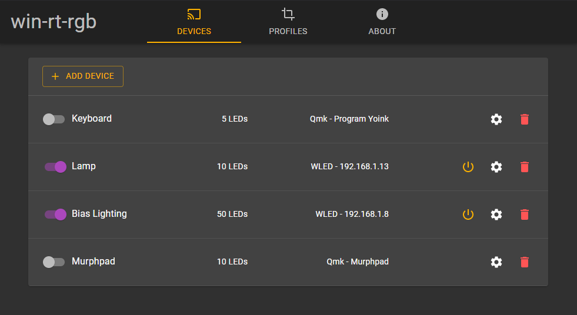
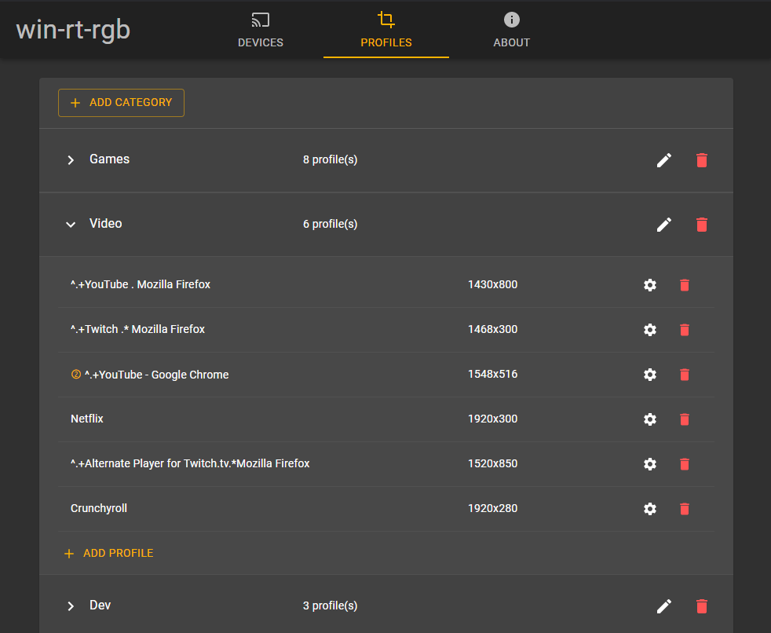

# win-rt-rgb

win-rt-rgb is an application for realtime ambient lighting based on display contents (see [Bias Lighting](https://en.wikipedia.org/wiki/Bias_lighting))
and audio (similar to [audio-reactive-led-strip]https://github.com/scottlawsonbc/audio-reactive-led-strip)).
The application can output color data to network devices running [WLED](https://github.com/Aircoookie/WLED) and keyboards
running [QMK](https://qmk.fm/).
It uses a resource-efficient c++ backend and an electron-based frontend.

## Screenshots

